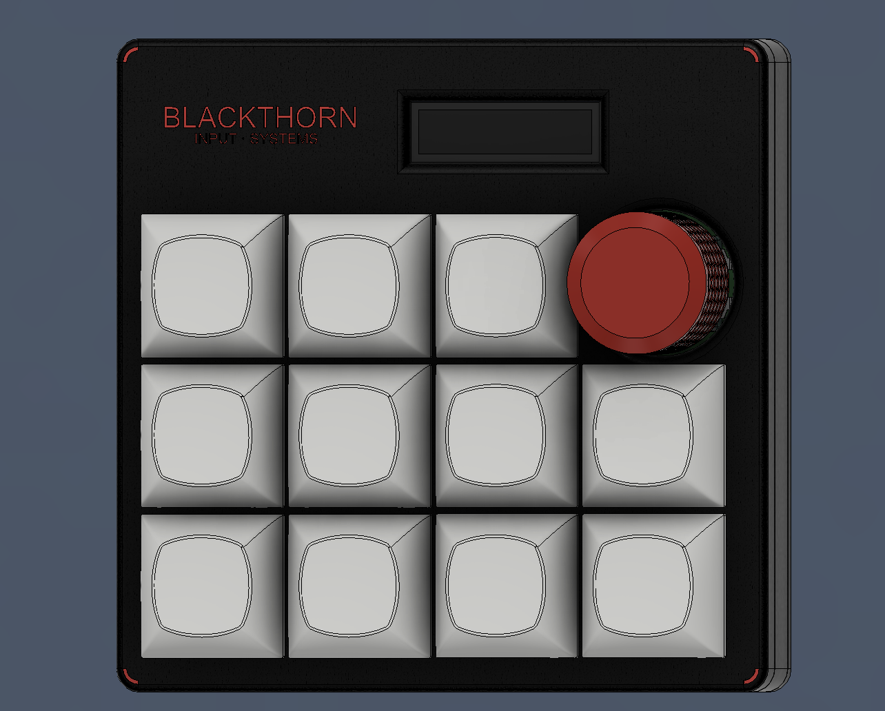
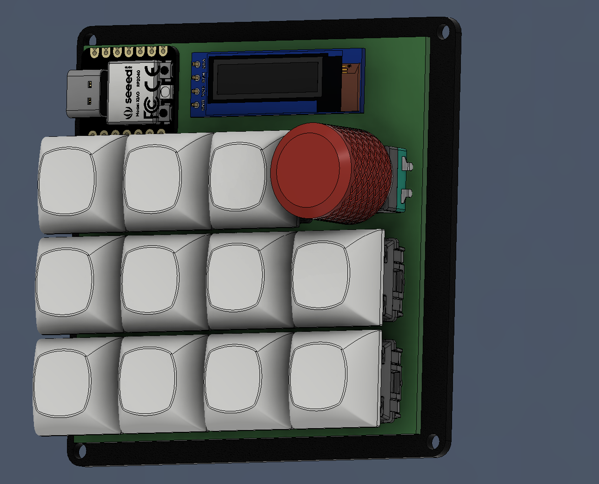
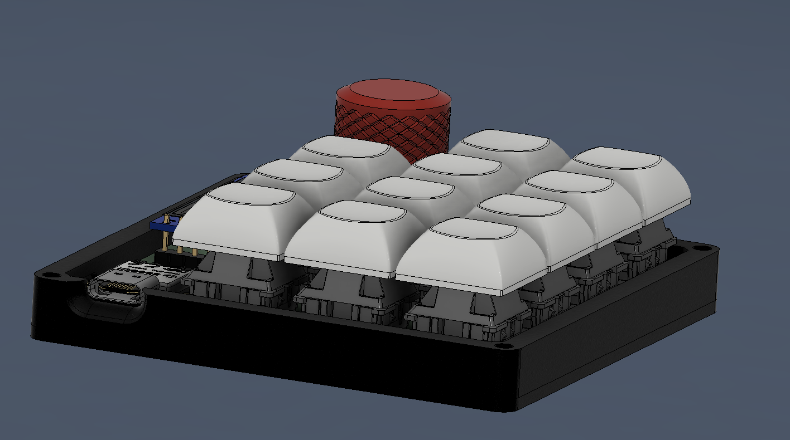
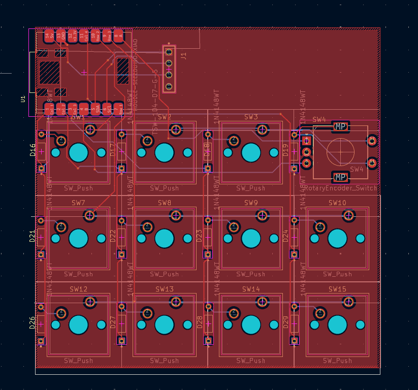
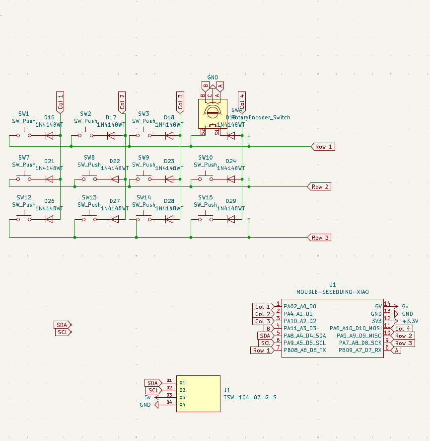

this is my custom key macropad using a seeed xiao rp2040. i built it mostly because i wanted something actually to help with Spotiy and shortcuts

it’s got a rotary encoder for volume, a small oled screen, and a 3x4 matrix its daily stuff like oping apps shuffle music ect.
right its

open firefox, spotify, discord
control volume with the knob
mute/unmute my mic
toggle vpn
run a timer that shows how long i’ve been working
show status on the screen (mic, vpn, timer)
still depding on wat annimation to use 

firmware is just circuitpython since it’s easy to change stuff quickly. might switch to qmk later but this works fine for now.

future stuff i might add:

better screen ui (icons instead of text)
animations
different modes depending on what i’m doing
proper linux integration instead of basic shortcuts

BOM
Seeed XIAO RP2040
1N4148 Diodes, 12, MX-Style switches, 12  MX-Style switches,0.91 inch OLED display, keycaps, 4x M3x16mm 
4x M3x5mx4mm heatset inserts